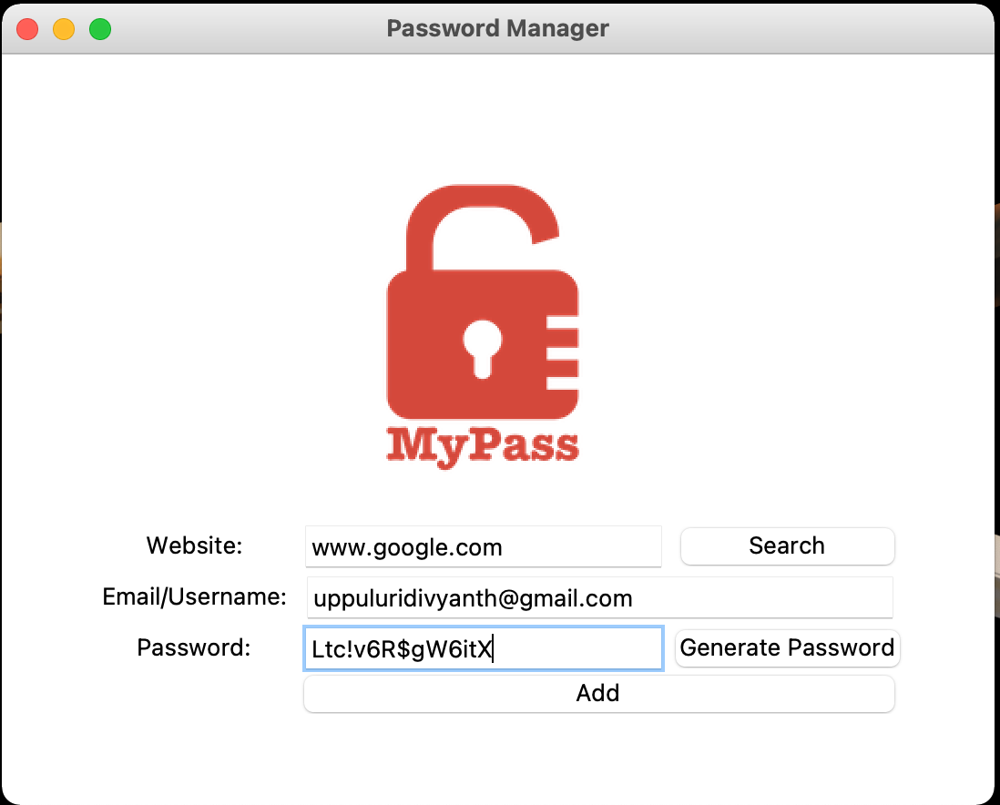

# Password Generator

A small gui app, built with python tkinter, can be used to generate strong passwords

## Installation

Download the zip file of the code and install tkinter module of python and then you are good to go to run it.

## Features

- A visullay interactive user interface.
- You can enter the website url you want to search the password for.
- You can add email for which the password is generated.
- All your passwords are stored in a data.json file.
## Screenshots

